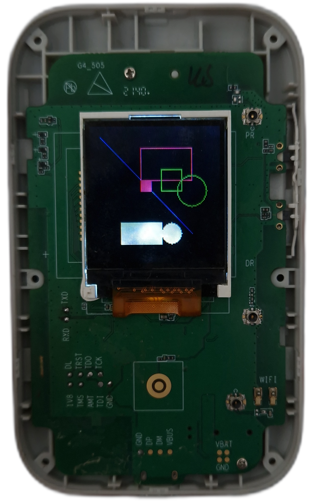
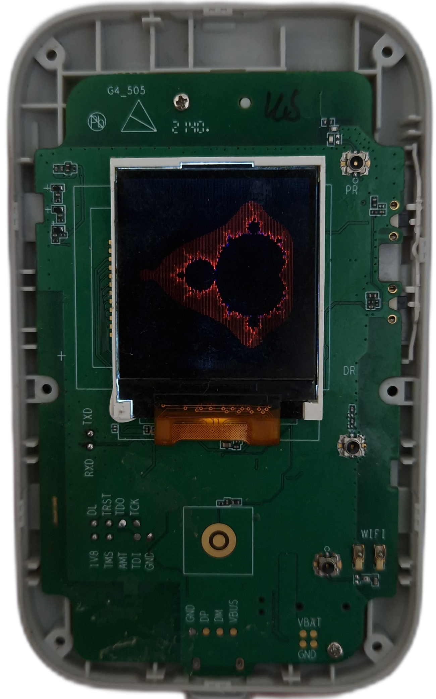

<p align="center">

  

</p>

A suite of PoC's/exploits/utils for ZX297520V3 based travel routers (tested on Kuwfi C920 which is based on ZTE MF910W).

## Blogs 

[[0] Getting Started + Reversing Web Server](https://luke-m.xyz/travel_router/p1.md)

[[1] It's Raining Bugs](https://luke-m.xyz/travel_router/p2.md)

[[2] Messing with the Display](https://luke-m.xyz/travel_router/p3.md)

## Functionality 

### `enable_telnet`

Exploits a command injection bug to enable telnet on the device. Once enabled, presented with a busybox shell.

```
python3 ZX297520V3_hax.py enable_telnet
telnet 192.168.1.1
```

### `upload_gdb`

Uploads the gdb binary to `/tmp` for convenience.

```
python3 ZX297520V3_hax.py upload_gdb
```

### `get_admin_pwd`

Exploits a pre-auth file rename vulnerability, as well as a weakness in the parsing of the QR code fetch URL, to get the admin password of the device without authentication.

```
python3 ZX297520V3_hax.py get_admin_pwd
```

### `overwrite_qr_code`

Exploits a pre-auth file write vulnerability to replace the generated QR code displayed on screen with a silly face.

```
python3 ZX297520V3_hax.py overwrite_qr_code
```


### `screen_run`

Uses auth bypass to get the admin password, file write to upload compiled binaries, and command injections to run them - resulting in the screen displaying something.

#### `graphics`

This displays some graphics primitives that could be used for visualisations.

```
python3 ZX297520V3_hax.py screen_run graphics
```



#### `mandelbrot`

This displays a visualisation of the mandelbrot set computed on the device.

```
python3 ZX297520V3_hax.py screen_run mandelbrot
```



#### `draw_image`

This displays an image on the screen, it must be of the ffmpeg `rgb565be` format and 128x128. You can use the following to convert from 128x128 image to `rgb565be` format:

```
ffmpeg -i repo_logo.png -pix_fmt rgb565be repo_logo.rgb
```

Usage:

```
python3 ZX297520V3_hax.py screen_run draw_image images/walter.rgb
```


### `flappy`

Runs through the process of getting pre-auth flappy bird execution by fetching the admin password using the auth bypass (`get_admin_pwd`), exploiting a file write vulnerability to write the compiled flappy bird binary, and then finally a command injection to run the binary.

```
python3 ZX297520V3_hax.py flappy
```


### `enterfold`

Lists the contents of a passed directory using a directory traversal bug.

```
python3 ZX297520V3_hax.py enterfold *full directory path*
```

### `upload_file`

Exploits a file write vulnerability to upload specified file to `/tmp`.

```
python3 ZX297520V3_hax.py upload_file *filename*
```

### `mkdir`

Uses directory traversal in pre-auth `HTTPSHARE_NEW` handler to create a directory in any specified location provided it is writeable.

```
python3 ZX297520V3_hax.py mkdir *full path*
```

### `remove`

Uses directory traversal in pre-auth `HTTPSHARE_DEL` handler to remove file in any specified location provided it is writeable.

```
python3 ZX297520V3_hax.py remove *full path to containing directory* *filename* 
```

### `rename`

Uses directory traversal in pre-auth `HTTPSHARE_FILE_RENAME` handler to rename file in any specified location provided it is writeable.

```
python3 ZX297520V3_hax.py rename *old file full path* *new file full path*
```

### `arb_cfg_clear_v1`

Exploits a config clear bug to wipe specified config value pre-auth, this can lock out the admin, and probably cause other interesting issues.

```
python3 ZX297520V3_hax.py arb_cfg_clear_v1 *key*
```

### `arb_cfg_clear_v2`

Exploits another (very similar) config clear bug to wipe specified config value pre-auth.

```
python3 ZX297520V3_hax.py arb_cfg_clear_v2 *key*
```

### `goform_get`

Fetches the config value with the specified key, admin password might be required.

```
python3 ZX297520V3_hax.py goform_get *key*
```

### `PINT_DIAGNOSTICS_START_inj`

PoC for command injection in PINT_DIAGNOSTICS_START goform set command - should cause device to reboot

```
python3 ZX297520V3_hax.py PINT_DIAGNOSTICS_START_inj
```

### `ADD_WHITE_SITE_inj`

PoC for command injection in ADD_WHITE_SITE goform set command - should cause device to reboot

```
python3 ZX297520V3_hax.py ADD_WHITE_SITE_inj
```

### `REMOVE_WHITE_SITE_inj`

PoC for command injection in REMOVE_WHITE_SITE goform set command - should cause device to reboot

```
python3 ZX297520V3_hax.py REMOVE_WHITE_SITE_inj
```

### `ADD_DEVICE_inj`

PoC for command injection in ADD_DEVICE goform set command - should cause device to reboot

```
python3 ZX297520V3_hax.py ADD_DEVICE_inj
```

### `DEL_DEVICE_inj`

PoC for command injection in EDIT_HOSTNAME goform set command - should cause device to reboot

```
python3 ZX297520V3_hax.py DEL_DEVICE_inj
```

### `EDIT_HOSTNAME_inj`

PoC for command injection in EDIT_HOSTNAME goform set command - should cause device to reboot

```
python3 ZX297520V3_hax.py EDIT_HOSTNAME_inj
```

### `DMZ_SETTING_inj`

PoC for command injection in DMZ_SETTING goform set command - should cause device to reboot

```
python3 ZX297520V3_hax.py DMZ_SETTING_inj
```

### `STATIC_DHCP_SETTING_inj`

PoC for command injection in STATIC_DHCP_SETTING goform set command - should cause device to reboot

```
python3 ZX297520V3_hax.py STATIC_DHCP_SETTING_inj
```

### `URL_FILTER_ADD_inj`

PoC for command injection in URL_FILTER_ADD goform set command - should cause device to reboot

```
python3 ZX297520V3_hax.py URL_FILTER_ADD_inj
```

### `BIND_STATIC_ADDRESS_ADD_inj`

PoC for command injection in BIND_STATIC_ADDRESS_ADD goform set command - should cause device to reboot

```
python3 ZX297520V3_hax.py BIND_STATIC_ADDRESS_ADD_inj
```

### `BIND_STATIC_ADDRESS_DEL_inj`

PoC for command injection in BIND_STATIC_ADDRESS_DEL goform set command - should cause device to reboot

```
python3 ZX297520V3_hax.py BIND_STATIC_ADDRESS_DEL_inj
```

### `REMOVE_WHITE_SITE_overflow`

PoC for stack overflow in REMOVE_WHITE_SITE goform set command - device will crash, can view overflow in gdb

```
python3 ZX297520V3_hax.py REMOVE_WHITE_SITE_overflow
```


### `CHANGE_MAC_overflow`

PoC for stack overflow in CHANGE_MAC goform set command - device will crash, can view overflow in gdb

```
python3 ZX297520V3_hax.py CHANGE_MAC_overflow
```


### `GOFORM_DELETE_SMS_crash`

PoC for crash in GOFORM_DELETE_SMS goform set command

```
python3 ZX297520V3_hax.py GOFORM_DELETE_SMS_crash
```


### `GOFORM_MOVE_TO_SIM_crash`

PoC for crash in GOFORM_MOVE_TO_SIM goform set command

```
python3 ZX297520V3_hax.py GOFORM_MOVE_TO_SIM_crash
```